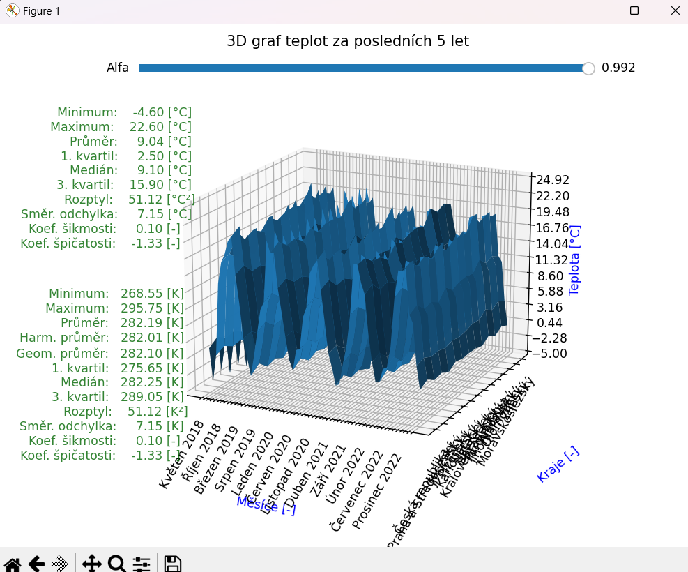

# MPC-CSI
* Číslicové signály a systémy
* Projekt: Statistické zpracování dat - Analýza meteorologických dat na území ČR

## Finální projekt (body 10/10):
* [Hlavní skript](main.py)
* [Instalace požadovaných knihoven](install_requirements.py)
* [Verze požadovaných knihoven](requirements.txt)
* [Dokumentace](dokumentace.pdf)

## Úvod
Tento skript slouží k analýze meteorologických dat v České republice. Jeho hlavním cílem je umožnit
uživatelům získávat a zpracovávat data o teplotách a srážkách a následně je vizualizovat v grafech.
Program nabízí možnost pracovat v režimu online nebo offline, s možností použití záložních online dat.

## Interakce
Interakce probíhá v terminálu až do vykreslení grafů. Podrobně je popsána interakce v [dokumentaci](dokumentace.pdf)
nebo jde kdykoliv v programu napsat 'h', 'help', 't', 'tut' nebo 'tutorial' pro výpis nápovědy.

## Uvítání a Grafy
Uvítání:
# 
### Ukázka grafů:
3D graf teplot za posledních 5 let pro všechny kraje:
# 
2D graf srážek za roky 2000-2010, pro zvolené 3 kraje:
# 
3D graf spektra teplot za posledních 5 let pro všechny kraje:
# 
Boxplot srážek za roky 2000-2022 pro všechny kraje:
# 
Korelace srážek za roky 2000-2022 pro Jihomoravský a Zlínský kraj:
# 

## Závěr
Při použití skriptu na analýzu a vizualizaci meteorologických dat je důležité mít na paměti, že tato
data jsou pod licencí CC BY-NC-ND 3.0 CZ. To znamená, že je nezbytné uvést původ dat, nepoužívat je
pro komerční účely a nezasahovat do díla, podrobnější informace lze nalézt na adrese:
[https://creativecommons.org/licenses/by-nc-nd/3.0/cz/](https://creativecommons.org/licenses/by-nc-nd/3.0/cz/).

V celém skriptu používám typing, což umožňuje lepší odhalení chyb v kódu a zvýšení jeho čitelnosti.
Během testování byla funkčnost skriptu pečlivě ověřena a byly ošetřeny všechny možné chybové
stavy, aby uživatelé mohli co nejjednodušeji a nejpřesněji pracovat s daty.
Skript poskytuje uživatelům užitečnou funkci na analýzu a vizualizaci meteorologických dat a může
být použit pro další výzkum.

Kód v Pycharmu byl pečlivě navržen tak, aby neobsahoval žádné warningy nebo PEP chyby. Přestože
zde mohou být některé weak warnings, avšak ty se dají bez problémů ignorovat.

Pro lepší čtení v kódu doporučuji použít IDE s možností zabalení tříd, funkcí nebo podmínek.

